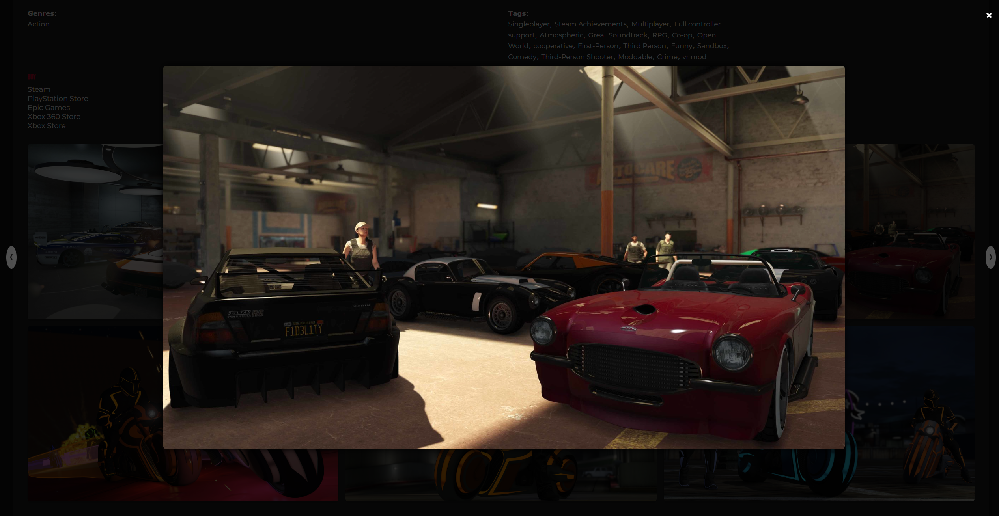

# 🚀 THE HYPER PROJECT

A dynamic web application to explore a vast catalog of video games via the [RAWG API](https://rawg.io/apidocs).  
This project focuses on interactivity, performance, and a clean design.

---

## 🧩 Features

- 🔍 Search and filter by platform, publisher, genre, developer, or keyword  
- 🗂️ Paginated game list with a **"Show more"** button  
- 📄 Rich detail page for each game:  
  - Description  
  - Release date  
  - Developers / Publishers / Platforms / Genres / Tags  
  - Purchase links to official stores  
  - Screenshot gallery with interactive modal  
  - Custom platform icons  
  - Suggested similar games  
- 🌐 Dynamic navigation without reload (SPA with custom router)  
- 💅 Modern and responsive styles using SCSS  

---

## ⚙️ Technologies Used

- 💻 JavaScript ES6 (modular architecture)  
- 🖼️ HTML5 / SCSS  
- 🧰 Webpack with Babel  
- 🔁 RAWG API ([https://api.rawg.io](https://api.rawg.io))  
- 🗺️ Custom router based on `window.location.hash`  

---

## 🚀 Running the Project

1. Clone the repo:

```bash
git clone https://github.com/your-username/the-hyper-project.git
cd the-hyper-project
```

2. Install dependencies:

```bash
npm install
```

3. Configure the RAWG API key:  
Create a file `config.js` inside `src/` with the following content:

```js
export const API_KEY = "your_rawg_api_key_here";
```

4. Start the development server:

```bash
npm run start
```

5. Build for production:

```bash
npm run build
```

🧠 Notes  
The router works with URL fragments (#pagelist, #pagedetail/slug, etc.)  
Pages are rendered dynamically inside the `#pageContent` div.  
No libraries or frameworks used; everything is vanilla JavaScript to master SPA fundamentals.

---

### Homepage  


### Game List  


### Detail Page  


### Modal Carousel  


---

📄 License  
Project created as a personal exercise / training.  
Free to use for educational purposes.
